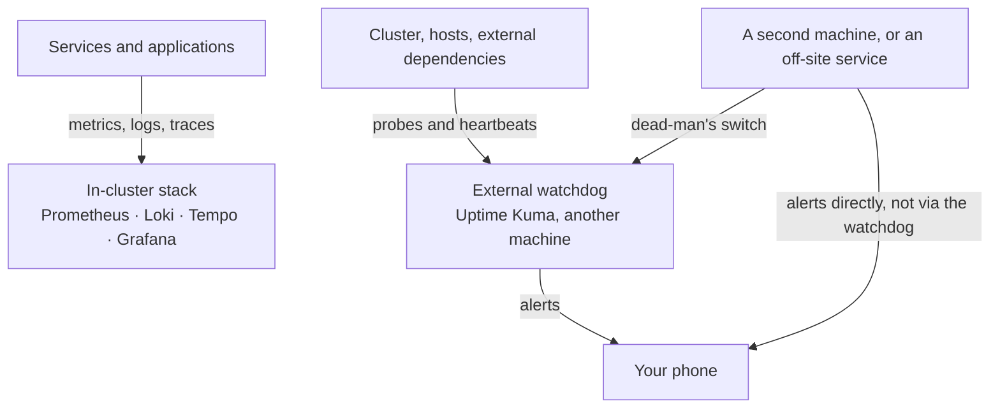

# Observability

UIS observability answers two different questions, and they need two different
systems:

| Question | Answered by | Runs |
|---|---|---|
| **Why is it slow? What happened?** | Prometheus, Loki, Tempo, Grafana | **inside** the cluster |
| **Is it up?** | Uptime Kuma | **outside** the cluster |

Most of this page is about why that split is structural rather than a matter of
taste.

## Services

| Service | Description | Deploy |
|---------|-------------|--------|
| [Prometheus](./prometheus.md) | Metrics collection and storage | `./uis deploy prometheus` |
| [Loki](./loki.md) | Log aggregation with label-based indexing | `./uis deploy loki` |
| [Alloy](./alloy.md) | Ships container logs into Loki — **without it Loki stays empty** | `./uis deploy alloy` |
| [Tempo](./tempo.md) | Distributed tracing backend | `./uis deploy tempo` |
| [OTLP Collector](./otel.md) | Telemetry pipeline routing to all backends | `./uis deploy otel-collector` |
| [Grafana](./grafana.md) | Visualization dashboards for all data | `./uis deploy grafana` |
| [Uptime Kuma](./uptime-kuma.md) | External availability watchdog — **deploy elsewhere** | `./uis deploy uptime-kuma` |

## Quick Start

```bash
./uis stack install observability
```

Or deploy individually:

```bash
./uis deploy prometheus
./uis deploy loki
./uis deploy tempo
./uis deploy otel-collector
./uis deploy grafana
```

All of the above deploy to the `monitoring` namespace.

[Uptime Kuma](./uptime-kuma.md) is deliberately **not** part of that stack
install. Deploying it next to what it watches defeats its purpose — see below.

## The in-cluster stack

```
Applications → OTLP Collector → Prometheus (metrics)
                              → Loki (logs)
                              → Tempo (traces)
                                     ↓
                                  Grafana (visualization)
```

1. Applications send telemetry via OTLP to the collector
2. The collector routes each signal to the appropriate backend
3. Grafana queries all three for unified visualization
4. Pre-built dashboards show service health and pipeline status

This is deep, high-cardinality, and cheap to query — because it lives next to
what it measures. That adjacency is also its one structural limit.

## Why an external watchdog is not optional

**A monitoring system cannot report its own death.** If the cluster is gone,
so is the Prometheus that would have told you. If the node is wedged, so is
Alertmanager. This is not a configuration gap you can close with more rules — no
amount of in-cluster alerting produces a signal when the cluster stops.

The consequence is the failure mode worth naming:

:::danger Absence renders as green
A monitor that was never created is indistinguishable from one that is passing.
A dashboard with no data looks calm. Alertmanager with zero rules never fires.
Silence and health look identical.
:::

So each layer is watched by something **outside** it:



Each box can only report on things below it, never on itself:

| Layer | Blind to |
|---|---|
| In-cluster stack | the cluster being down |
| External watchdog | its own host being down |
| Second machine | the whole site losing power or internet |

Read it as a rule rather than a diagram: **whatever watches layer N must not
live in layer N.** Applied honestly it does not terminate — a watchdog on a
second machine still cannot report a site-wide power failure. At some point you
accept a boundary; the discipline is knowing where you put it instead of
discovering it during an incident.

## Three kinds of signal

The watchdog and the in-cluster stack are not just differently placed. They
detect different classes of failure.

| Signal | Direction | Detects | Missed by |
|---|---|---|---|
| **Probe** | pull — something asks | an endpoint stopped answering | nothing much; this is the well-covered case |
| **Heartbeat** | push — a job reports in | **work that stopped happening** | metrics-based alerting, badly |
| **Dead-man** | absence of a push | the watchdog itself died | everything else, by definition |

Heartbeats are the capability nothing else provides. When a scheduled job simply
stops running, no pod crashes, no endpoint goes down, and no error rate moves —
there is nothing for a threshold to fire on. A heartbeat that stops arriving is
unambiguous, and a heartbeat window is a deadline rather than a threshold.

:::tip Push after the success check, never before
A job that calls its heartbeat URL unconditionally reports success when it fails.
That is worse than no heartbeat, because it manufactures confidence. Put the call
after the job's own success check — in a shell script under `set -e`, that means
the last line; in a systemd unit, `ExecStartPost`, which runs only if `ExecStart`
exited 0.
:::

## Two rules for probes

**Probe what a user depends on, not the process that provides it.** Whether a pod
is `Running` is the in-cluster stack's job. Whether the endpoint answers is the
watchdog's.

**A 200 can lie.** Check content, not just status. A gateway can return HTTP 200
while its database is unreachable, because the response never touched the
database. Match a keyword you would only see if the thing genuinely works.

## Alerting

An alert that nobody receives is a log entry, and a dashboard nobody is watching
is a screensaver. Uptime Kuma supports many notification providers; the choice
matters less than two properties:

- **It must not depend on the thing being monitored.** A channel that routes
  through your own infrastructure fails exactly when you need it.
- **It must be quiet when things are fine.** Attach alerting only to monitors
  whose failure is both real and actionable. Anything that pages for a laptop
  going to sleep, or for a job that was never started, trains you to swipe alerts
  away — and then you swipe away the real one.

See [Uptime Kuma](./uptime-kuma.md) for configuration.

## Monitors are generated, not written

You do not hand-write availability monitors. Each service ships a probe artifact
saying *how* to check it; UIS discovers *where* it is from the `Service` and
`Ingress` it created:

```bash
uis deploy uptime-kuma
uis monitors apply
```

Nothing asks for a hostname — you did not need one to deploy the service, so you
should not need one to monitor it. Targets UIS did **not** deploy (a hypervisor,
a NAS, a job heartbeat) go in `.uis.extend/monitors.yaml`, which is empty on a
stock install.

See [Uptime Kuma](./uptime-kuma.md) for both topologies: a developer running
everything in one cluster, and an operator running the watchdog on a separate
machine.

:::info Not yet automated
**Dashboards** per service, and **alert rules** for the in-cluster stack. A
freshly deployed Prometheus collects everything and alerts on nothing, so it
tells you what happened *after* you go looking. Tracked in the
[ai-developer plans](../../ai-developer/plans/index.md).
:::
